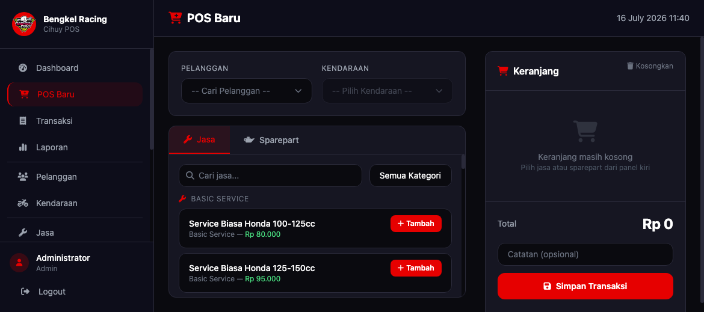
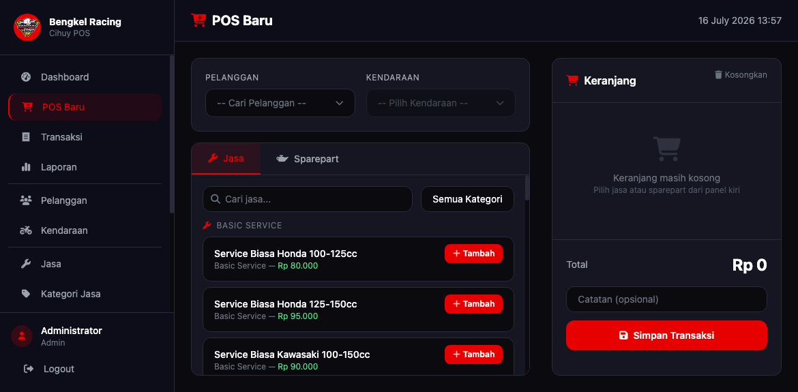
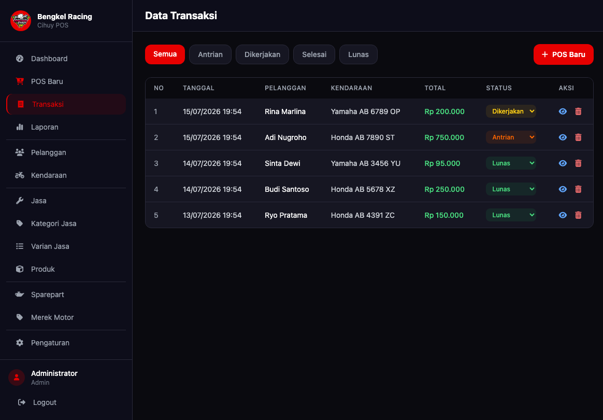
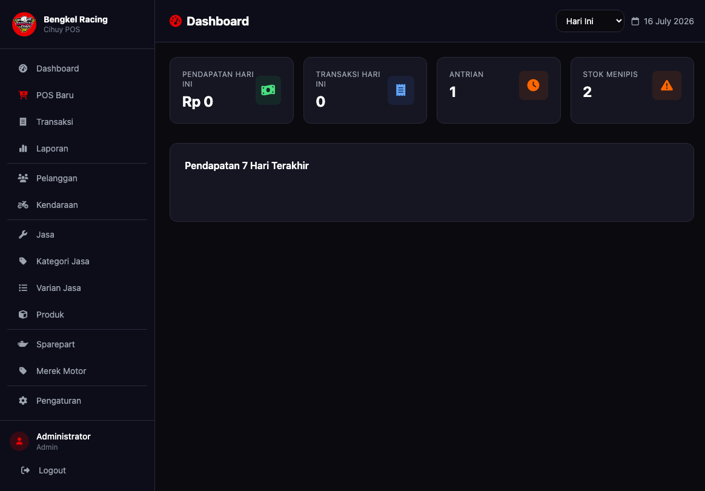
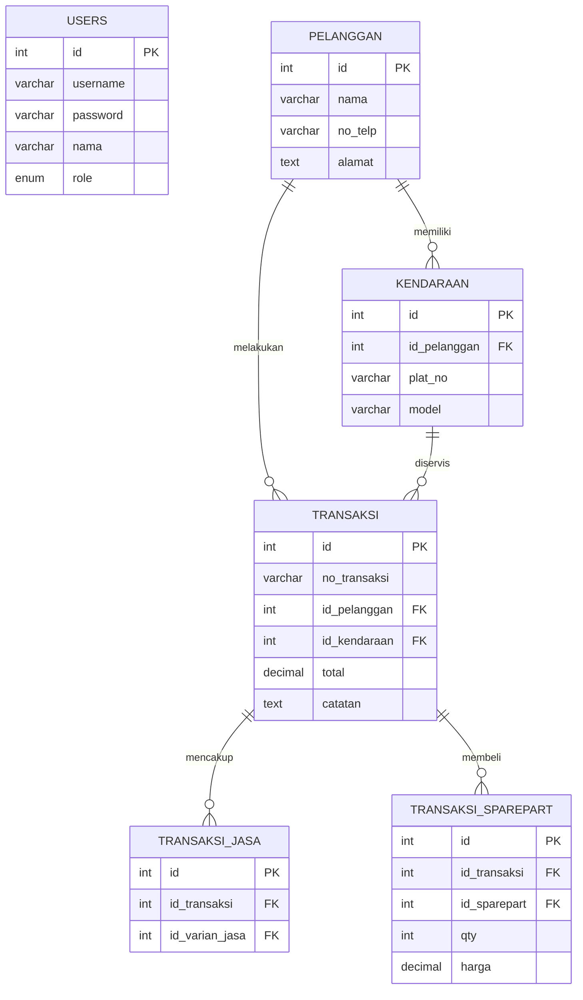

# Laporan Tugas UAS Praktikum Pemrograman Web

## 1. Deskripsi Project
Sistem POS (Point of Sales) Bengkel adalah aplikasi berbasis web yang dirancang untuk mengelola transaksi jasa perbaikan dan penjualan suku cadang (sparepart) pada sebuah bengkel. Aplikasi ini mempermudah pencatatan pelanggan, kendaraan, hingga proses transaksi secara *real-time* dengan fitur keranjang belanja yang dinamis. 

Fitur Utama:
- **Manajemen Transaksi**: Proses POS yang responsif, mengelompokkan kategori jasa, suku cadang, dan menghitung total harga secara otomatis.
- **Manajemen Pelanggan & Kendaraan**: Menyimpan data riwayat pelanggan dan kendaraan.
- **Manajemen Jasa & Sparepart**: Pencatatan layanan perbaikan dan stok barang.
- **Dashboard Interaktif**: Ringkasan transaksi dan pendapatan.

## 2. Link Penting
- **URL GitHub**: [https://github.com/baguskara1/uas-pemweb-praktikum](https://github.com/baguskara1/uas-pemweb-praktikum)
- **URL Video Demo**: [Google Drive Link](https://drive.google.com/drive/folders/1HfNmJ8nKIyGhCtzyaTa4rFpT1Z0X4vZH?usp=sharing)

## 3. Screenshot Fitur

### Halaman Login

### Dashboard Utama

### Transaksi Baru (POS)

### Data Pelanggan

## 4. Struktur Database (Schema)

Berikut adalah struktur database utama (ERD / Relasi Tabel):

Struktur ini mendukung pencatatan yang terintegrasi antara data master dan data transaksi harian bengkel.
